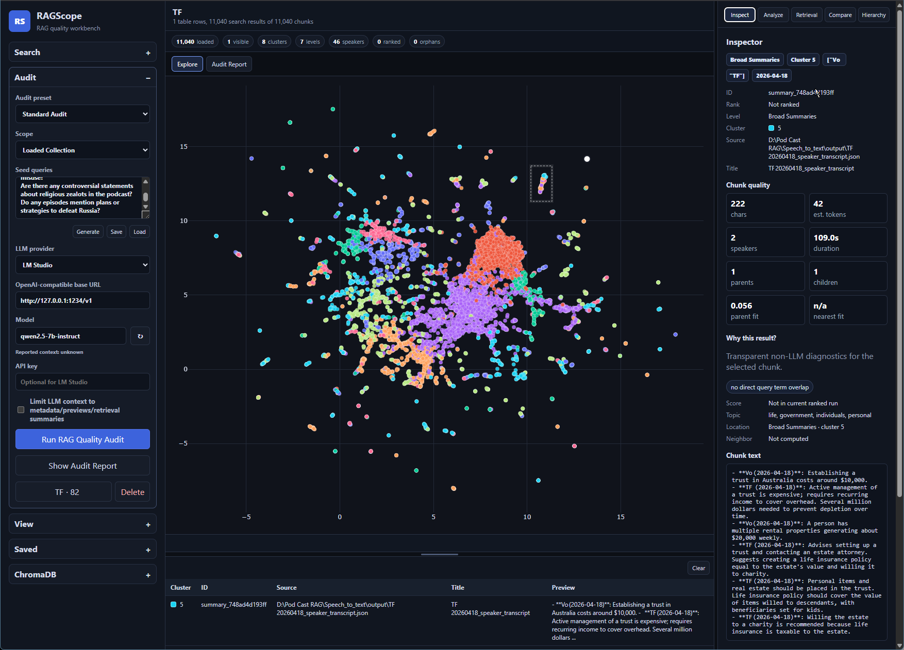
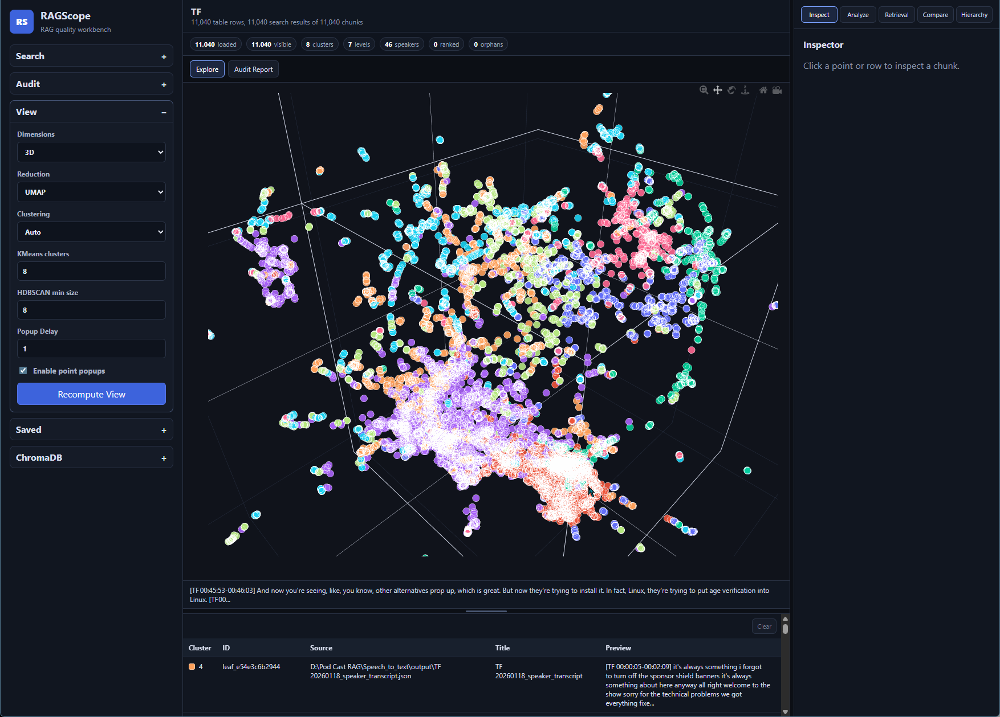
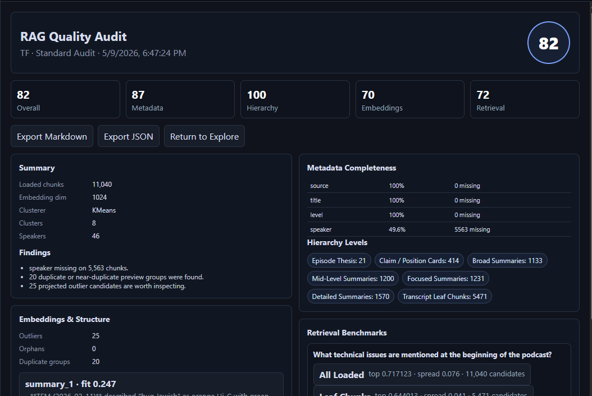

# RAGScope

RAGScope is a local React/FastAPI workbench for investigating RAG systems end to end: vector structure, retrieval behavior, metadata quality, hierarchy health, semantic neighborhoods, and audit reports. It is designed to work well with the podcast RAG ecosystem:

1. `Podcast-Host-Transcription-Pipeline`
2. `Podcast-RAG-pipeline`
3. `Chroma DB Import`
4. `PodCast Chat`

The app visualizes embedded document chunks, clusters semantic neighborhoods, labels topics without requiring an LLM, supports search and inspection workflows, runs retrieval experiments and RAG quality audits, and persists investigative workspaces as JSON saved views.

## Screenshots

### 2D Semantic Map



### 3D Semantic Map



### RAG Quality Audit



## Run

Use the Windows launcher:

```powershell
.\Run RAGScope.ps1 -CreateVenv
```

That script creates or updates the Python virtual environment, installs the React packages, starts the FastAPI backend, writes the runtime config used by the browser UI, and starts the React/Vite frontend. It defaults to backend port `8765` and frontend port `5173`, but automatically moves to the next open ports if another copied instance is already running.

```text
http://127.0.0.1:5173
```

To launch with a specific ChromaDB path preloaded:

```powershell
.\Run RAGScope.ps1 -ChromaPath "D:\Pod Cast RAG\ChromaDB\PODCAST"
```

The launcher writes `frontend/public/runtime-config.js` at startup so copied folders point their React UI at the backend instance that was actually launched with that copy.

Manual development startup:

```powershell
python -m venv .venv
.\.venv\Scripts\Activate.ps1
python -m pip install --upgrade pip
python -m pip install -r requirements.txt
cd frontend
npm install
npm run dev
```

In a second terminal:

```powershell
.\.venv\Scripts\python.exe -m uvicorn backend:app --host 127.0.0.1 --port 8765
```

Production frontend build:

```powershell
cd frontend
npm install
npm run build
```

Backend syntax check:

```powershell
python -m py_compile backend.py server/main.py server/schemas.py
```

The default ChromaDB path is:

```text
./chroma
```

Change it in the ChromaDB sidebar section to point at a persistent Chroma directory, such as a podcast export folder generated by `Chroma DB Import`.

## Features

### ChromaDB Connection

- Connects to a persistent local ChromaDB path.
- Provides a ChromaDB section for selecting and validating the local ChromaDB folder.
- Falls back to reading collection names from `chroma.sqlite3` when Chroma client inspection has a transient startup failure.
- Validates the ChromaDB path without stealing focus from manual path entry.
- Opens directly to the ChromaDB sidebar section on startup when the configured path is invalid or empty.
- Lists available Chroma collections.
- Loads ids, documents, embeddings, and metadata.

### Semantic Visualization

- Reduces embeddings to 2D with UMAP by default.
- Toggles between 2D and 3D embedding views.
- Falls back to PCA when UMAP is unavailable or fails.
- Displays an interactive Plotly scatter plot in a React layout that fills the available browser height.
- Enables mouse-wheel zoom while the pointer is over the chart.
- Shows compact point hover popups with only the chunk preview.
- Persists a `Popup Delay` preference.
- Allows point popups to be disabled from the View section.

### Clustering And Topic Discovery

- Clusters with HDBSCAN when available, otherwise KMeans.
- Colors points by cluster, topic label, source, title, or any detected metadata field.
- Builds topic labels from TF-IDF keyword extraction.
- Shows representative chunks nearest each cluster centroid in the backend response.
- Highlights clusters from the topic panel and highlights points from table selections.

### Search, Selection, And Inspection

- Filters the table and inspector to selected chart points.
- Supports text search and Chroma semantic search.
- Highlights semantic search results and nearest neighbors.
- Shows a searchable table with id, cluster, source, title, preview, and metadata available in the inspector.

### RAG Evaluation

- Runs deterministic Phase 1 RAG quality audits with metadata, hierarchy, embedding, duplicate, outlier, and retrieval-mode scoring.
- Adds optional Phase 2 LLM-assisted audit query generation and interpretation through LM Studio or any OpenAI-compatible chat-completions endpoint.
- Allows generated audit query batches to be reviewed, edited, saved as JSON, and reloaded for repeatable database comparisons.
- Detects LLM context-window errors when available, retries oversized audit prompts with a smaller context, and reports LLM output diagnostics when responses are truncated, malformed, or repetitive.

### Workspace And UI

- Uses browser viewport height to resize the chart and right-side information panel.
- Provides a draggable divider between the chart and table.
- Persists the user-adjusted table height in local browser storage and saved views.
- Persists popup settings in saved views and autosave.
- Shows persistent toast notifications for significant warnings and errors, with full-message copy support.
- Saves and restores workspaces across sessions.

## RAG Quality Audits

RAGScope includes an audit workspace for turning a vector database into a repeatable evaluation artifact. The deterministic audit scores metadata completeness, hierarchy coverage, embedding structure, duplicate groups, outliers, orphaned hierarchy nodes, and retrieval behavior across saved or generated benchmark queries.

Optional LLM assistance can be enabled through LM Studio or another OpenAI-compatible chat-completions endpoint. The LLM can generate reviewable query batches and interpret deterministic audit results. Generated query batches can be saved and reloaded as JSON so different databases can be compared against the same test set.

## Saved Views

Saved views are JSON files stored in:

```text
./saved_views
```

Each saved view records:

- unique id
- name
- description
- timestamp
- ChromaDB path
- collection name
- dimensionality reduction settings
- clustering settings
- metadata filters
- color mode
- text and semantic search queries
- highlighted and selected chunk ids
- visible and hidden clusters
- chart pan/zoom state when Plotly exposes it
- sidebar settings
- table height
- notes

The Saved section includes controls to:

- Save Current View
- Load Saved View
- Delete View

Saved views are written as portable JSON files. Rename, duplicate, import/export, bookmarks, and comparison workflows are planned extension points.

## Podcast RAG Metadata

The app does not hardcode podcast metadata fields, but it recognizes common fields produced by the podcast pipeline:

- `speaker`
- `speakers`
- `source`
- `source_file`
- `episode_title`
- `episode_date`
- `episode_sort_key`
- `node_type`
- `node_id`

It will also surface arbitrary metadata fields as `meta.<field>` columns and make them available for filtering and coloring.

## Performance Notes

- Use `Max load` in the ChromaDB section for large collections.
- The React table renders the first 2,000 visible rows to keep the browser responsive.
- UMAP, PCA, clustering, and topic labeling run in the FastAPI backend.
- Projection and dataset responses are cached locally under `.cache/`, which is ignored by git.
- Missing embeddings are handled gracefully, but plotting is limited.
- Empty collections show an informational message instead of failing.

## Architecture

- `backend.py` is a compatibility shim that exposes `backend:app` for the launcher.
- `server/` contains the FastAPI backend package, schemas, routes, scoring, caching, state models, and analysis helpers.
- `frontend/` contains the Vite React application.
- `frontend/src/lib/` contains shared React constants, formatting helpers, and Plotly view-state helpers.
- `screenshots/` contains README images showing the 2D view, 3D view, and audit report.
- `saved_views/` stores JSON workspace files.

## Optional Dependencies

`hdbscan` is treated as optional. On Windows it may require build tooling, so the app automatically falls back to KMeans when HDBSCAN is unavailable.

## Future Extension Points

The state model is centralized in `server/state.py` so these features can be added later:

- bookmarks
- snapshots
- collaborative/shared views
- URL-shareable state
- saved camera positions
- pinned clusters
- user-defined tags
- saved semantic search presets
- saved comparison sessions
- temporal diff views between collections
- side-by-side saved-view comparison
- graph/network visualization of nearest neighbors
