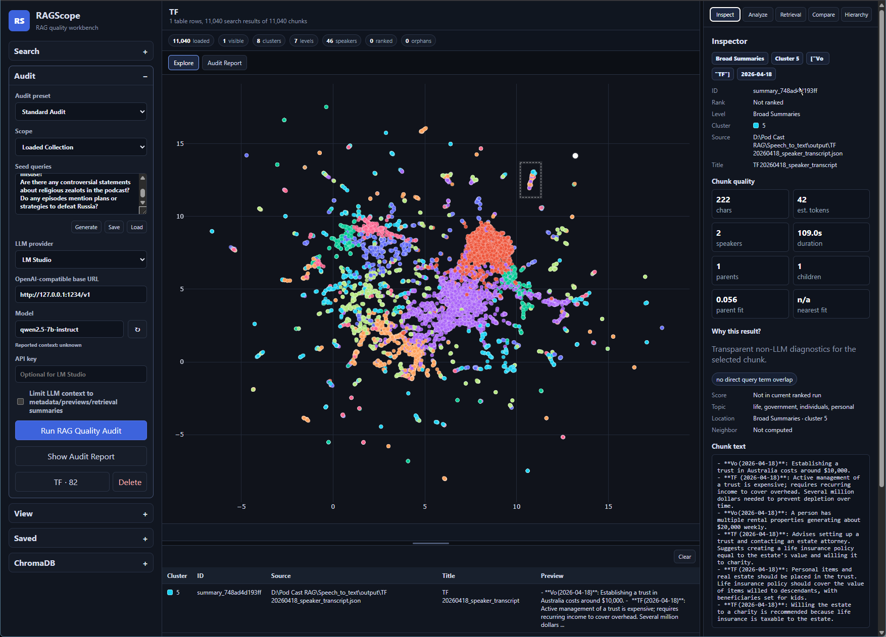
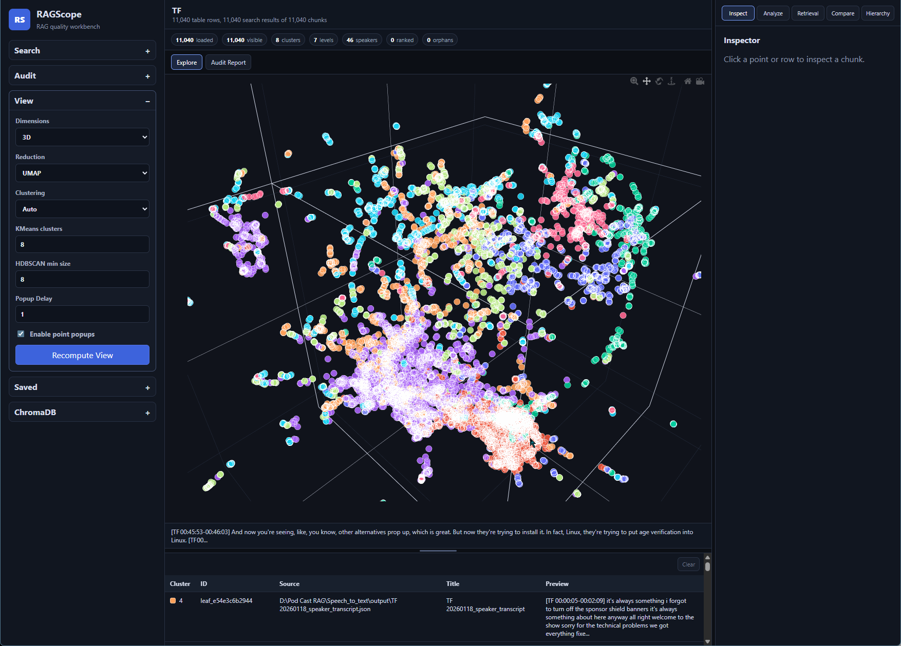
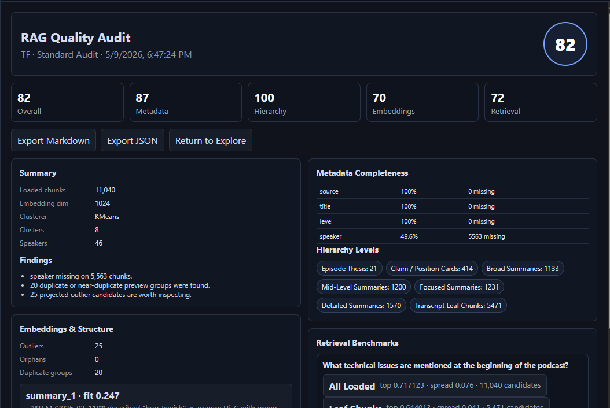

# RAGScope

RAGScope is a local React/FastAPI workbench for investigating RAG systems end to end: vector structure, retrieval behavior, metadata quality, hierarchy health, semantic neighborhoods, and audit reports. It is designed to work well with the podcast RAG ecosystem:

1. `Podcast-Host-Transcription-Pipeline`
2. `Podcast-RAG-pipeline`
3. `Chroma DB Import`
4. `PodCast Chat`

The app visualizes embedded document chunks, clusters semantic neighborhoods, labels topics without requiring an LLM, supports search and inspection workflows, runs retrieval experiments and RAG quality audits, and persists investigative workspaces as JSON saved views.

## Clean-machine packaging

The Python direct dependencies are exact-pinned in `requirements.txt`. The frontend uses the checked-in `package-lock.json` (or `pnpm-lock.yaml`), and `Run RAGScope.ps1` owns backend cleanup on normal close and PowerShell exit. The Stage 10 diagnostic validates both frontend installation/build and the synthetic benchmark; large-collection diagnostics remain an explicit target-machine check.

The local `podcast-evaluation-pack-v1` reference manifest, readiness validator, and normalized run identity are documented in [`docs/evaluation-pack-v1.md`](docs/evaluation-pack-v1.md).

RAGScope's ecosystem contract reader accepts transcription `correction-manifest-v1` and `correction-manifest-v2`. V2 correction notifications may be placed under `state/transcription_corrections`; affected source-span IDs are exposed as stale-judgment inputs so human evidence is routed back to adjudication instead of being silently carried across changed transcript text.

## Screenshots

### 2D Semantic Map



### 3D Semantic Map



### RAG Quality Audit



## Run

Use the Windows launcher:

```powershell
.\Run RAGScope.ps1 -CreateVenv
```

The root script is a compatibility wrapper around [`scripts/Run RAGScope.ps1`](scripts/Run%20RAGScope.ps1). It creates or updates the Python virtual environment, installs the React packages, starts the FastAPI backend, writes the runtime config used by the browser UI, and starts the React/Vite frontend. It defaults to backend port `8765` and frontend port `5173`, but automatically moves to the next open ports if another copied instance is already running.

```text
http://127.0.0.1:5173
```

To launch with a specific ChromaDB path preloaded:

```powershell
.\Run RAGScope.ps1 -ChromaPath "D:\Pod Cast RAG\ChromaDB\PODCAST"
```

The launcher writes `frontend/public/runtime-config.js` at startup so copied folders point their React UI at the backend instance that was actually launched with that copy.

Manual development startup:

```powershell
python -m venv .venv
.\.venv\Scripts\Activate.ps1
python -m pip install --upgrade pip
python -m pip install -r requirements.txt
cd frontend
npm install
npm run dev
```

In a second terminal:

```powershell
.\.venv\Scripts\python.exe -m uvicorn backend:app --host 127.0.0.1 --port 8765
```

Production frontend build:

```powershell
cd frontend
npm install
npm run build
```

Backend syntax check:

```powershell
python -m py_compile backend.py server/main.py server/api.py server/schemas.py server/services/*.py
```

The default ChromaDB path is:

```text
./chroma
```

Change it in the ChromaDB sidebar section to point at a persistent Chroma directory, such as a podcast export folder generated by `Chroma DB Import`.

## Features

### Semantic Visualization

- Provides 2D and 3D embedding views.
- Reduces embeddings to 2D with UMAP and PCA.
- Interactive scatter plot.

### Clustering And Topic Discovery

- Clusters with HDBSCAN.
- Colors points by cluster, topic label, source, title, or any detected metadata field.
- Builds topic labels from TF-IDF keyword extraction.
- Shows representative chunks nearest each cluster centroid in the backend response.

### Search, Selection, And Inspection

- Filters the table and inspector to selected chart points.
- Supports text search and Chroma semantic search.
- Highlights semantic search results and nearest neighbors.
- Shows a searchable table with id, cluster, source, title, preview, and metadata available in the inspector.

### RAG Evaluation

- Runs deterministic Phase 1 RAG quality audits with metadata, hierarchy, embedding, duplicate, outlier, and retrieval-mode scoring.
- Adds optional Phase 2 LLM-assisted audit query generation and interpretation through LM Studio or any OpenAI-compatible chat-completions endpoint.
- Allows generated audit query batches to be reviewed, edited, saved as JSON, and reloaded for repeatable database comparisons.
- Detects LLM context-window errors when available, retries oversized audit prompts with a smaller context, and reports LLM output diagnostics when responses are truncated, malformed, or repetitive.

## RAG Quality Audits

RAGScope includes an audit workspace for turning a vector database into a repeatable evaluation artifact. The deterministic audit scores metadata completeness, hierarchy coverage, embedding structure, duplicate groups, outliers, orphaned hierarchy nodes, and retrieval behavior across saved or generated benchmark queries.

Optional LLM assistance can be enabled through LM Studio or another OpenAI-compatible chat-completions endpoint. The LLM can generate reviewable query batches and interpret deterministic audit results. Generated query batches can be saved and reloaded as JSON so different databases can be compared against the same test set.

## Saved Views

Saved views are JSON files stored in:

```text
./saved_views
```

Each saved view records:

- unique id
- name
- description
- timestamp
- ChromaDB path
- collection name
- dimensionality reduction settings
- clustering settings
- metadata filters
- color mode
- text and semantic search queries
- highlighted and selected chunk ids
- visible and hidden clusters
- chart pan/zoom state when Plotly exposes it
- sidebar settings
- table height
- notes

The Saved section includes controls to:

- Save Current View
- Load Saved View
- Delete View

Saved views are written as portable JSON files. Rename, duplicate, import/export, bookmarks, and comparison workflows are planned extension points.

## Podcast RAG Metadata

The app does not hardcode podcast metadata fields, but it recognizes common fields produced by the podcast pipeline:

- `speaker`
- `speakers`
- `source`
- `source_file`
- `episode_title`
- `episode_date`
- `episode_sort_key`
- `node_type`
- `node_id`

It will also surface arbitrary metadata fields as `meta.<field>` columns and make them available for filtering and coloring.

## Performance Notes

- Use `Max load` in the ChromaDB section for large collections.
- The React table renders the first 2,000 visible rows to keep the browser responsive.
- UMAP, PCA, clustering, and topic labeling run in the FastAPI backend.
- Projection and dataset responses are cached locally under `.cache/`, which is ignored by git.
- Missing embeddings are handled gracefully, but plotting is limited.
- Empty collections show an informational message instead of failing.

## Architecture

- `backend.py` is a compatibility shim that still exposes `backend:app` for launchers and copied environments.
- `server/api.py` owns the FastAPI application and route layer.
- `server/services/` splits backend responsibilities into path validation, frame loading, caching, retrieval scoring, LLM utilities, and deterministic analysis helpers.
- `server/state.py` and `server/persistence.py` define the portable saved-workspace contract.
- `frontend/src/App.jsx` is now a thin shell that composes the UI.
- `frontend/src/hooks/useRagScopeController.jsx` centralizes client-side orchestration and API workflows.
- `frontend/src/components/` breaks the interface into sidebar, workspace, audit, info-panel, and overlay modules.
- `frontend/src/lib/` contains shared constants, formatting helpers, and Plotly view-state helpers.
- `scripts/` contains operational launchers, and `docs/` contains roadmap and supporting notes.
- `saved_views/` stores JSON workspace files and `screenshots/` contains the README images.

## Verification

The repo includes a lightweight regression layer under `tests/` for portable workspace serialization and helper behavior:

```powershell
python -m unittest discover -s tests -t .
```

## Optional Dependencies

`hdbscan` is treated as optional. On Windows it may require build tooling, so the app automatically falls back to KMeans when HDBSCAN is unavailable.

## Future Extension Points

The state model is centralized in `server/state.py` so these features can be added later:

- bookmarks
- snapshots
- collaborative/shared views
- URL-shareable state
- saved camera positions
- pinned clusters
- user-defined tags
- saved semantic search presets
- saved comparison sessions
- temporal diff views between collections
- side-by-side saved-view comparison
- graph/network visualization of nearest neighbors
